# Huddle

Huddle is a local events board for Bahrain. Post an event like a padel night, a photo walk or a board games night, RSVP as going or maybe, and chat with everyone going in the comments. Events have a capacity, so once they're full no one else can RSVP as going.

This repo is the front end. The back end lives here: [huddle-backend](https://github.com/IDAC1899/huddle-backend)

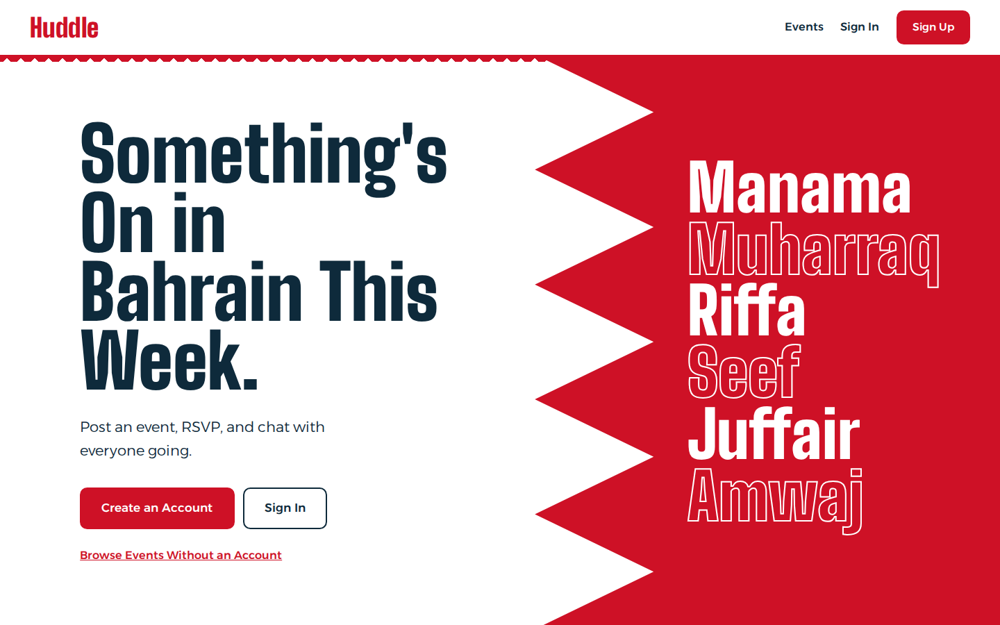

## Screenshots

**Upcoming events**

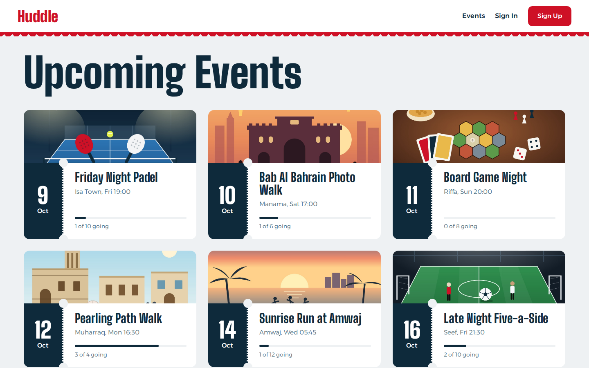

**Event page** with the RSVP panel, who's going, and comments with likes

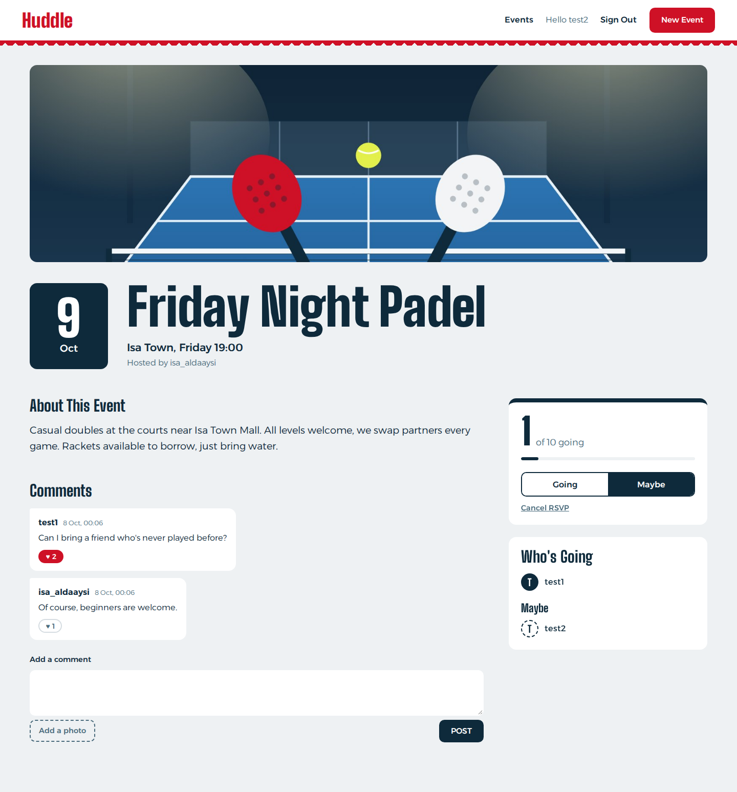

**Dashboard** with the events you're hosting and your RSVPs

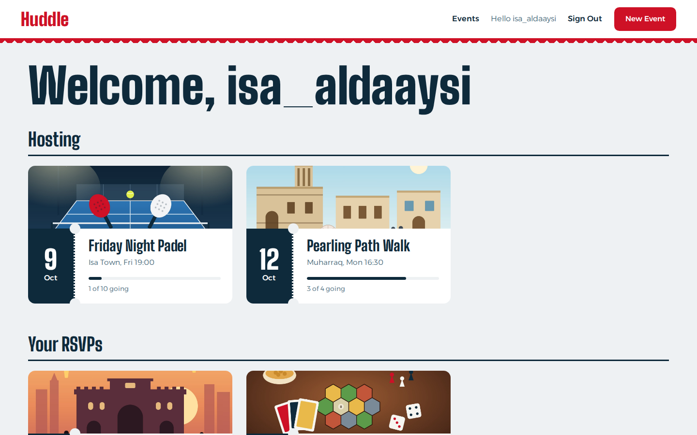

**New / edit event** with a header photo

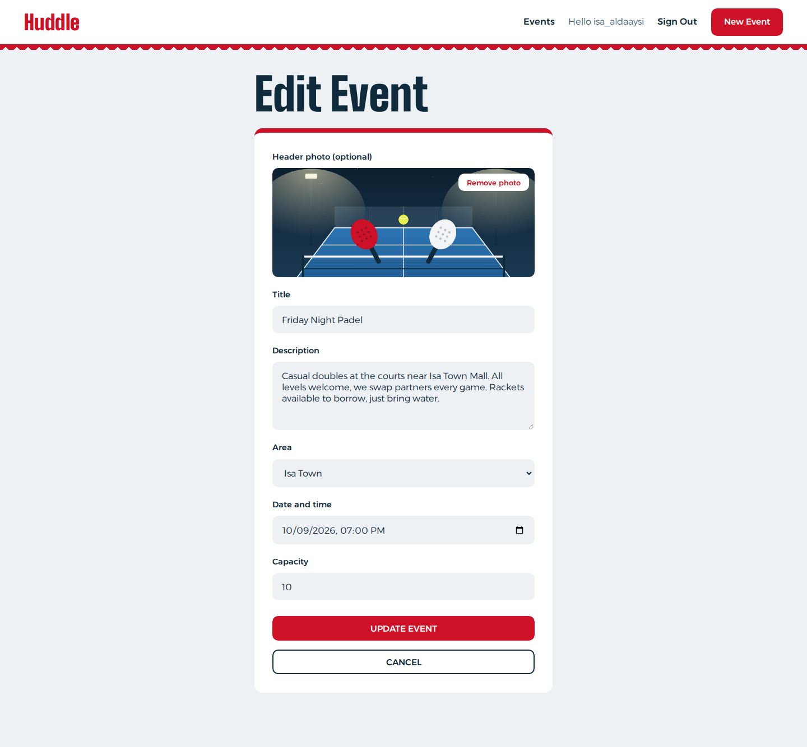

**Sign-up popup** when a guest tries to RSVP, comment or like

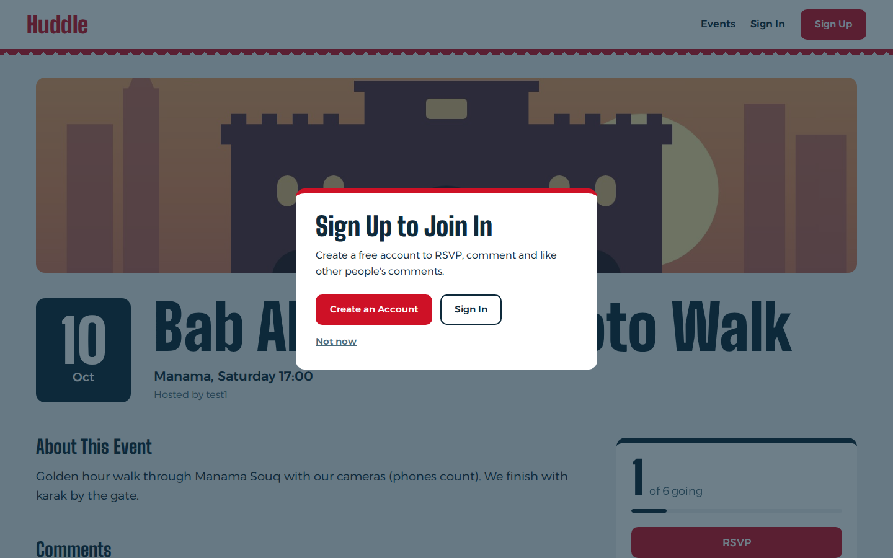

**On a phone**

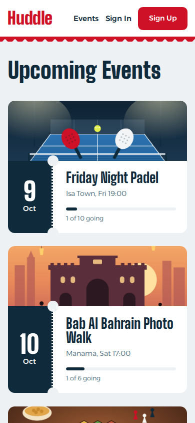

## Features

- Sign up, sign in and sign out (JWT)
- Browse upcoming events as a guest, soonest first
- Host an event with a title, description, area, date, capacity and an optional header photo
- Edit or delete your own events, including changing or removing the photo
- RSVP as going or maybe, switch between them, or cancel
- Full events show a "Full" stamp and block new going RSVPs
- Comment on events with an optional photo, and edit or delete your own comments
- Like other people's comments (you can't like your own)
- Dashboard showing the events you're hosting and the ones you've RSVP'd to
- Guests who try to RSVP, comment or like get a popup to sign up
- Works on phones, laptops and projectors

## Technologies Used

- React (Vite)
- React Router
- JavaScript, HTML and CSS
- JWT auth from the GA React JWT template
- Fonts: Big Shoulders Display and Alexandria (Google Fonts)

## Design

The look is based on the Bahrain flag and event tickets:

- The landing page is split white and red, with the flag's 5 points and the areas of Bahrain listed like a poster
- Event cards are tickets, with a date stub, a tear line, a bar showing how many spots are taken, and a red "Full" stamp
- Events without a photo show a small flag with the area name
- Comments show as chat bubbles, with your own on the right
- Everything is sized in rem, so the site scales from phones up to projectors

## Pages

| Route | Who can see it | Page |
|---|---|---|
| `/` | Everyone | Landing page for guests, Dashboard when signed in |
| `/events` | Everyone | Upcoming events |
| `/events/:eventId` | Everyone | Event page with RSVPs and comments |
| `/events/new` | Signed in | Host a new event |
| `/events/:eventId/edit` | Signed in (host) | Edit an event |
| `/events/:eventId/comments/:commentId/edit` | Signed in (owner) | Edit a comment |
| `/sign-up` | Guests | Create an account |
| `/sign-in` | Guests | Sign in |

## Planning

### Component Hierarchy


### Wireframes

**Events list**


**Event details**

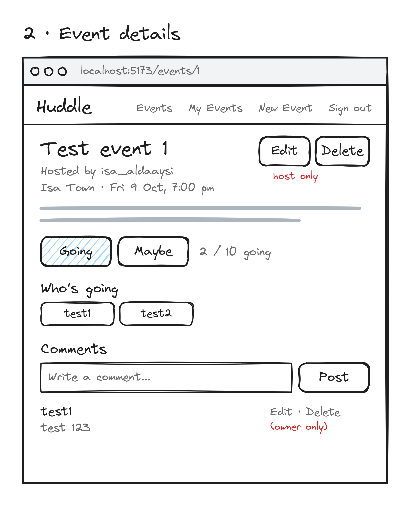

**New / edit event**

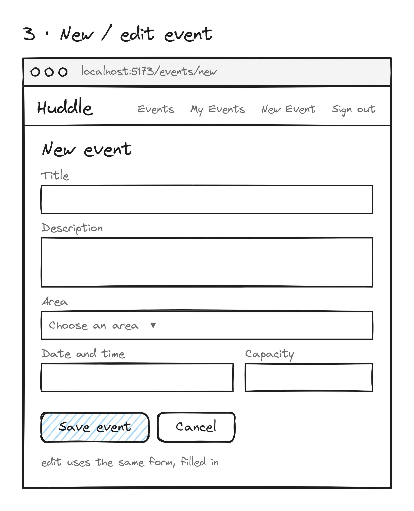

**My events**

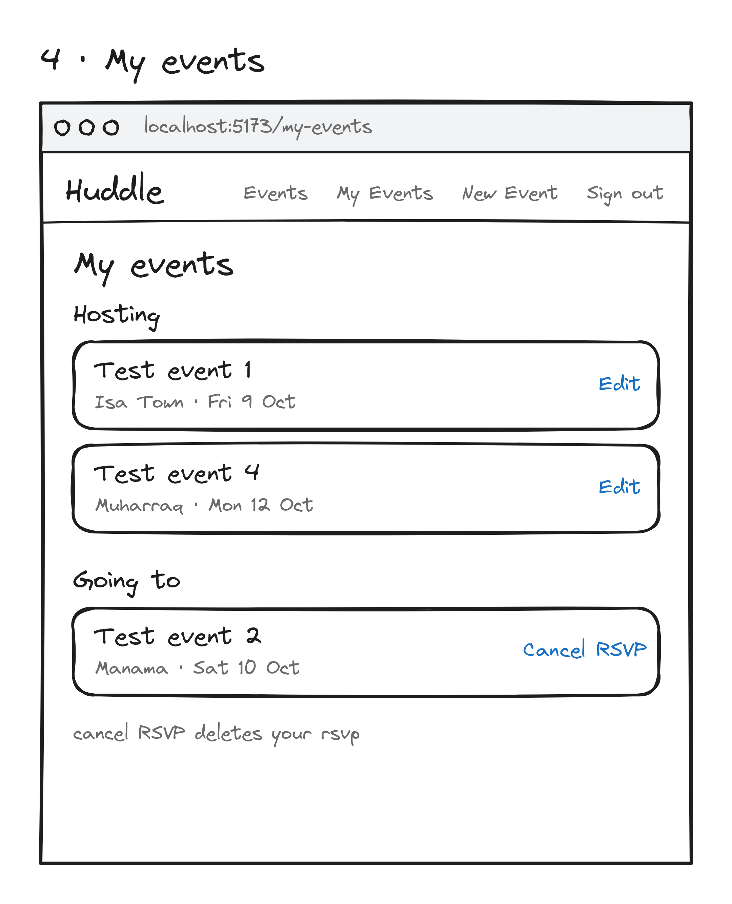

**Sign up / Sign in**

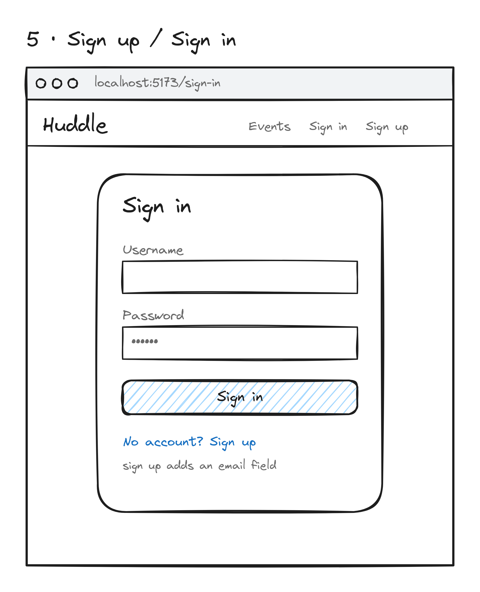

## Getting Started

1. Set up and start the [back end](https://github.com/IDAC1899/huddle-backend) first.
2. Clone this repo and install packages:
```bash
   npm install
```
3. Create a `.env` file in the root:
```
   VITE_BACK_END_SERVER_URL=http://localhost:8000/api
```
4. Start the app:
```bash
   npm run dev
```
5. Open http://localhost:5173. Seeded users all have the password `123` (`isa_aldaaysi`, `test1` to `test4`).

## Next Steps

- Deploy the front and back end
- Store photos on an image host like Cloudinary instead of in the database
- Event categories (sports, study, gaming) with filters
- Search events by area
- Waitlist when an event is full
- Notifications when someone comments on your event